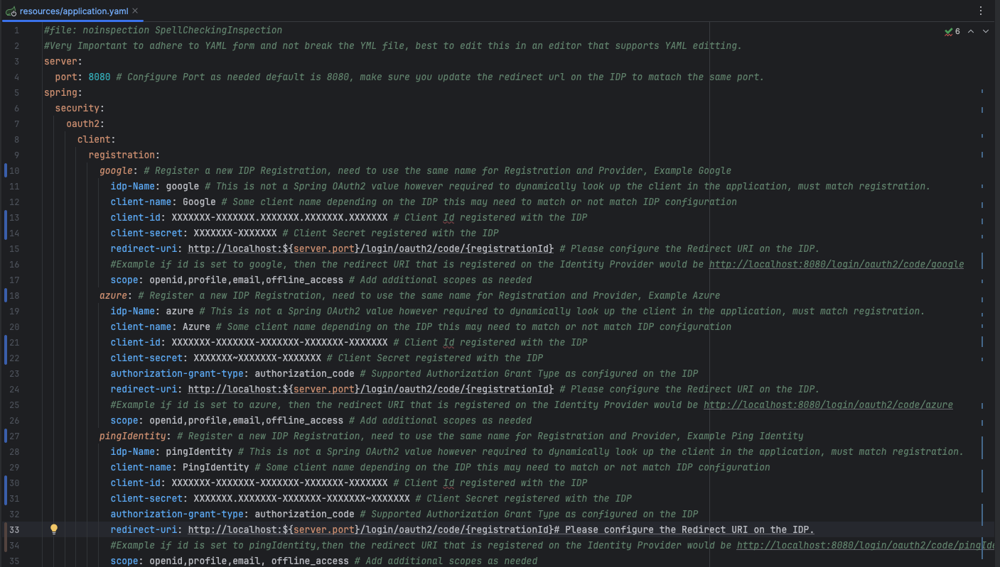

# Testing Open ID Connect Configurations using Spring Security OAuth2 Client

A walkthrough on Open ID Connect and an implementation via Spring Security OAuth2 Client to quickly validate any Open ID Connect configurations.

Code: [OIDC Check Application](https://github.com/MalcolmPereira/oidc-check)

## What is Open ID Connect ?

There is a wealth of documentation available on the internet regarding this topic. To avoid redundancy, I will instead focus on an analogy and highlight the key aspects that one must know when discussing OpenID Connect.

Before we jump into the analogy, a key point to always remember: authentication and authorization are not the same; they each serve a different purpose.

- Authentication: 

  Confirms that a user is who they claim to be by validating the information they provide, such as credentials, biometrics, and other tokens.

- Authorization: 

  Confirms that a user is authorized to perform a certain action based on the privileges they have been granted.

### Analogy: Local Library

- The Library (Service Provider/Resource Server) (Authorization)

  The library represents a service provider, it needs to validate your identity before you are borrow books or use other services in the library facility. The library may require you to have certain privileges to borrow or access certain restricted resources.   

- Your Library Card (ID Token)
   
    The Library Card is your Identification (ID Token) containing your details and proving that you are an authorized member of the library.

- The Membership Desk (Identity Provider/Authorization Server) (Authentication)
   
    The membership desk is responsible for issuing your library card and also confirming your identity proving that you are indeed a valid member of the library. The membership desk may grant you privileges of the types of services you can avail at the library.    

- Borrowing Books (Authorization) (Access Token)

    When you want to borrow a book, you present your library card to the librarian (the service provider). The librarian checks the card's authenticity and makes sure it's still valid. If everything checks out, you are allowed to borrow the book.

- Using Library Resources Printers/Scanners/Audio-Video Equipment (Single Sign-On SSO) (Access Token)  

    Once you're in the library system, you can access other services Printers/Scanners/Audio-Video Equipment without needing to reprove your identity, the librarian already knows who you are when they confirmed the card's authenticity. 

Now some key terminologies. 

### OAuth 2.0 (Authorization)

OAuth 2.0 is an authorization framework that enables applications to obtain limited access to user accounts; It works by delegating user authentication to the service that hosts the user account, and authorizing other applications limited access to the user account, by limited I mean the end user is always involved and consents to what information they are willing to share with other applications. Users credentials are never exposed to applications.

- Access Token

    After the user consents permission to the application, the authorization server issues an access token. This token is used by applications to access services on behalf of the user. Bearer Tokens are the predominant type of access token used with OAuth 2.0, may be used interchangeably. Access tokens are what the applications use to make requests to an API. The access token is meant to be read and validated by service provider. This is an opaque token, will be used by the Authorization Server to determine associated user information and permissions.

- Grant Types: OAuth 2.0 defines several grant types for different use cases
  - Authorization Code Grant: Used for web and mobile apps where the client can securely store secrets.
  - Implicit Grant: Used for browser-based apps where secrets cannot be securely stored.
  - Resource Owner Password Credentials Grant: Used when the user trusts the client with their credentials.
  - Client Credentials Grant: Used for server-to-server communication.

- Scope Parameter

    During the authorization request, the client specifies the scope of access it is requesting. The scope parameter allows the user to grant specific levels of access to the services on behalf of the user.

- Refresh Token

    OAuth 2.0 supports the issuance of refresh tokens that can be used to obtain new access tokens without requiring the user to re-authenticate.

### Open ID Connect (Authentication)

OIDC is used for user authentication. It provides a way to verify user's identity. OpenID Connect (OIDC) is an identity layer built on top of  OAuth 2.0. It allows clients to verify the identity of the end-user based on the authentication performed by an authorization server, as well as to obtain information about the user.

- ID Token

    When a user logs in, the authorization server issues an ID token to the client. This token contains information about the user, such as their unique identifier (sub), name, email, and other profile information. ID tokens are meant to be read by the application client. Access tokens are meant to be read by the service provider server.

- User Info Endpoint

    OIDC defines a UserInfo endpoint that the client can use to obtain more information about the user, if needed.

- JWT Format

    The ID token is typically a JSON Web Token (JWT), which is a compact, URL-safe means of representing claims to be transferred between two parties.

- Scope Parameter

    During authentication, clients can request specific scopes to obtain more information about the user e.g., openid, profile, email.

- Relying Party

  The application that is requesting user information that initiates the OIDC flow is called Relying Party.

OpenID Connect is built on top of OAuth 2.0. While OAuth 2.0 handles authorization granting third-party applications access to resources, OpenID Connect handles authentication verifying user identity. OIDC uses OAuth 2.0's authorization capabilities to provide an authentication layer, allowing clients to securely obtain information about the user.

### Open ID Connect Flows

Modern applications will use one of the following OIDC flows to integrate OIDC when accessing services on behalf of users without requiring users to share their credentials. Applications may choose one of the flows based on its security requirements.

- Implicit Flow

    This is common use case for Single Page Applications where the access token is returned directly in the redirection URL.

- Authorization Code Flow

    This OIDC flow is more secure than implicit, access token is not directly returned, rather an authorization code if first returned and then the application can exchange that for an access token. This flow should be only used in confidential applications because applications authentication method are included in the exchange.

- Proof Key for Code Exchange (PKCE)

    This OIDC flow further enhances security of the Authorization Code Flow, by introducing a code challenge and code verifier which is required in addition to the authorization code to exchange it for an access token.

- Hybrid Flow

    In this OIDC flow the application stores the Client Credential (Client ID, Client Secret or a Private JWT key), this allows the application to have immediate access to the ID Token. 

## Open ID Connect Configurations

Utilizing Open ID Connect in applications involve configurations on the Identity Provider example Google, FaceBook, Microsoft Azure, AWS Cognito etc. and then using those configurations within an application. The main configurations that are utilized in a client application are the following:

- Authorization URI

  This is the endpoint for authorization the Identity Provider also known as Authorization Server, an application will call this URL in an OIDC Flow to get an Authorization Code which can be later exchanged for an Access Token.

- Token URI

  This is the endpoint to get an access token from the Identity Provider, an application will call this URI after it receives an authorization code and exchange that for an access token.  

- User Info URI

  This is the endpoint to obtain more information about the user.

- JWK URI

  JSON Web Key URI returns set of keys containing the public keys used to verify ID Token which is predominantly returned as JSON Web Token (JWT).

- Redirect URI/Callback URI

  This is the callback URL to redirect to after Authorization, This must be registered with the Identity Provider, the client application receives the authorization code on this redirect url that is called by the Identity Provider. 

- Client Id

  The ID for your application registered with the Identity Provider.

- Client Secret

  The secret for your application that the Identity Provider generates, based on the Identity Provider, this value may be only shown once.

- Scope

  The scope of access the application is requesting, common scopes include - openid,profile,email,offline_access

- Authorization Grant Type

  This is the type of Authorization Grant type the application is requesting which will be one of - Authorization Code, PKCE, Client Credentials, Device Code, Refresh Token. This will depend on configuration in Identity Provider on what type of grants are allowed.
 

- Client Authentication Method

  This is the client authentication method that has been configured on the Identity Provider supported types include - Client Secret Basic, Client Secret Post, Client Secret JWT, Private Key JWT, Self Signed TLS Client Auth, TLS Client Auth

All of these URI are available from the Identity Provider via Open ID Discovery Specification where an Identity Provider publishes an endpoint typically ending with well-known/openid-configuration.   

## Testing Open ID Connect Configurations with SpringBoot

Springs spring-boot-starter-oauth2-client can be used to quickly validate Open ID Configuration, The oidc-check application builds over spring-boot-starter-oauth2-client to quickly validate any OIDC Configuration.

### Oidc-check application in action

The oidc-check application is a Java 17 based SpringBoot application made up of a spring application.yaml containing OIDC configurations and an executable spring boot application jar. These are available in the dist folder.

1. Navigate to the dist folder

2. Configure the OIDC Flow in the application.yaml

   

   

3. Run the oidc-check application

   

4. Select an OIDC Provider and complete OIDC Flow   
    

5. List attributes that come back from the OIDC Provider including access tokens and refresh tokens.
   

The above application run consisted of multiple IDP configurations in the application.yaml file, one can add new ones as needed to the application.yaml by updating as follows

Keep the IDP ID for Registration, Provider and IDP Name the same, this is very important, then configure other settings for the IDP and you are good to go, you will need to read over the documentation for the IDP to understand the configurations required for the client application registration, they are mostly consistent but sometimes subtle differences may occur. 

Please refer to the following Spring Documentation if you need to extend this further.

[Core Spring OAuth2 Classes](https://docs.spring.io/spring-security/reference/reactive/oauth2/client/core.html)

[Authorization Grant Types](https://docs.spring.io/spring-security/site/docs/current/api/org/springframework/security/oauth2/core/AuthorizationGrantType.html)

[Client Authentication Method](https://docs.spring.io/spring-security/site/docs/current/api/org/springframework/security/oauth2/core/ClientAuthenticationMethod.html)

### References:

[OAuth 2.0 Playground](https://www.oauth.com/playground/)

[OAuth 2.0 Simplified](https://www.oauth.com)

[Discover Open ID Connect](https://openid.net/developers/discover-openid-and-openid-connect/)

[How OpenID Connect Works](https://openid.net/developers/how-connect-works/)

[What is OpenID Connect (OIDC)?](https://auth0.com/intro-to-iam/what-is-openid-connect-oidc?utm_source=google&utm_campaign=amer_namer_can_all_ciam-dev_dg-plg_auth0_search_google_pmax_retarget_utm2&utm_medium=cpc&utm_id=aNK4z000000UFOhGAO&gad_source=1&gbraid=0AAAAACmv60W8PCyZ0Dg2nXsii9hMaUC0E&gclid=EAIaIQobChMIx73n6ey1hwMVZM3CBB0YggtIEAAYASAAEgIAivD_BwE)

[OAuth 2.0](https://oauth.net/2/)

[Spring OAuth2 Client](https://docs.spring.io/spring-security/reference/reactive/oauth2/client/index.html)

